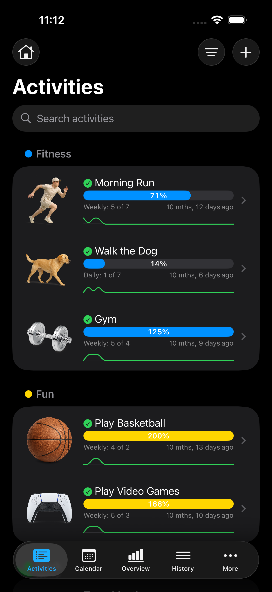
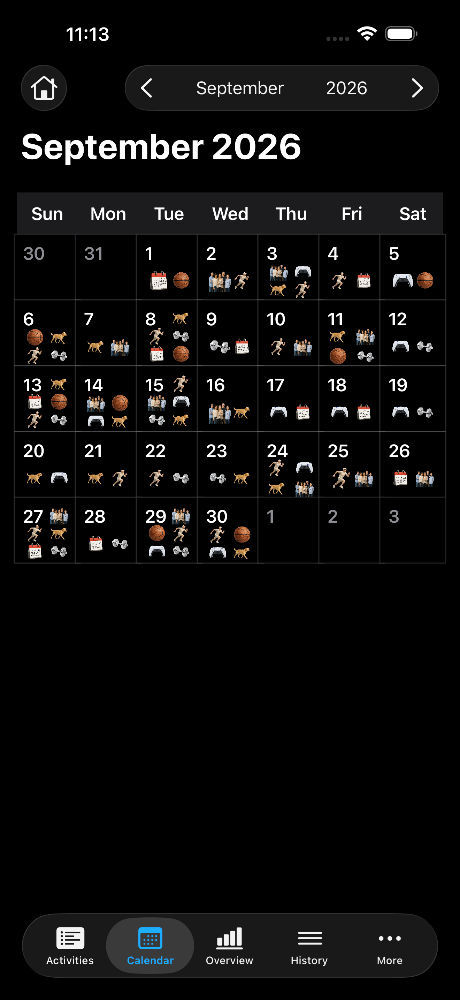
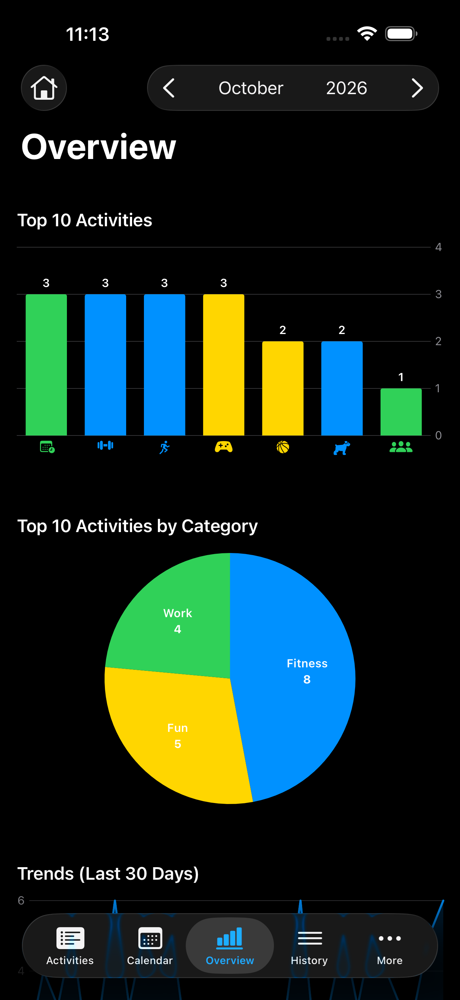
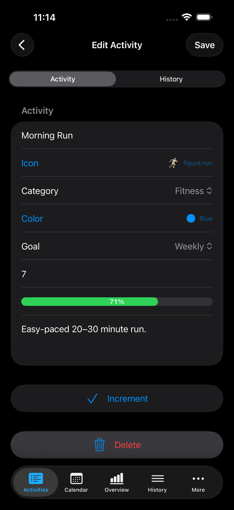
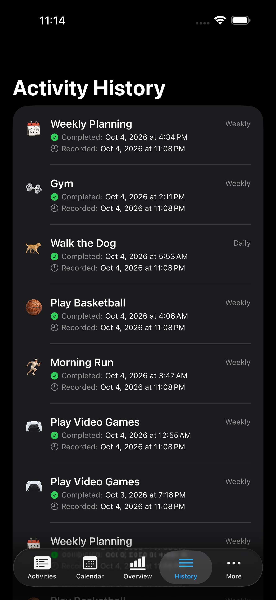
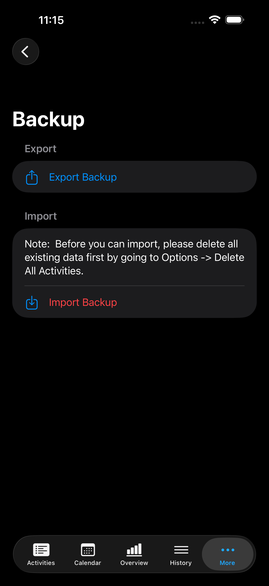

# Life 2.0

A native iPhone and iPad app for tracking recurring activities, building routines, and seeing patterns in what you complete. Set goals for fitness, work, and everyday life, log completions, and explore your progress through calendars and charts.

Built with **SwiftUI**, **SwiftData**, **Swift Charts**, and **Foundation Models**. Requires **iOS / iPadOS 26.1 or later**.

## Screenshots

Captured from the running app on an iPhone 16 Pro Max simulator with iOS 26.1, using test data in dark mode. Select an image to view it at full size.

<table>
  <tr>
    <th>Activities</th>
    <th>Calendar</th>
    <th>Overview</th>
  </tr>
  <tr>
    <td><a href="docs/screenshots/activities.png"></a></td>
    <td><a href="docs/screenshots/calendar.png"></a></td>
    <td><a href="docs/screenshots/overview.png"></a></td>
  </tr>
  <tr>
    <th>Activity details</th>
    <th>History</th>
    <th>Backup</th>
  </tr>
  <tr>
    <td><a href="docs/screenshots/activity-details.png"></a></td>
    <td><a href="docs/screenshots/history.png"></a></td>
    <td><a href="docs/screenshots/backup.png"></a></td>
  </tr>
</table>

## Major features

- **Recurring goals and quick logging.** Create daily, weekly, monthly, yearly, or non-recurring activities with custom target counts. Swipe an activity to mark it done, and track progress with gauges and optional monthly history charts.
- **Search and category organization.** Group activities into custom categories, filter by category, and search activity or category names. Give categories their own icons and colors.
- **A visual activity calendar.** Browse months with arrows or swipe gestures, see completion icons on each day, and tap a date to inspect, add, or delete history entries.
- **Progress analytics.** View the selected month's top 10 activities and their category breakdown, completion trends over the last 30 days, and activity streak charts.
- **AI insights.** Generate summaries of trends and streaks, plus encouragement, through Apple's Foundation Models framework. Insights require the system model to be available on the device; availability can differ on simulators.
- **Detailed activity history.** Browse all completions with the newest first. Open an activity's History section to add entries, adjust completion dates and times, or delete entries.
- **Personalized appearance.** Choose SF Symbols or bundled realistic icons, activity colors, and notes. Options control icon size, realistic artwork, gauge animation and colors, monthly row charts, and adjacent-month calendar icons.
- **Local storage and JSON backups.** SwiftData stores activities, categories, and completion history on the device. Export all three to a single JSON file and restore them through the Backup screen.
- **Built-in sample data tools.** Create starter activities and use developer options to generate sample history for exploring the app. Icon Viewer and SF Symbol Formatter are also included.

On iPhone, additional screens such as Categories, Options, and Export / Import are available under **More**.

> **Import behavior:** importing requires an empty activity list and replaces stored categories, activities, and history. Export a backup before clearing data through **Options → Delete All Activities**.

## Run the project

1. Clone the repository and open the Xcode project:

   ```sh
   git clone https://github.com/Sincioco/life2.git
   cd life2
   open "Life 2.0.xcodeproj"
   ```

2. Use Xcode with the iOS 26.1 SDK or later, select the **Life 2.0** scheme, and choose an iPhone or iPad simulator running iOS 26.1 or later.
3. Press **⌘R** to build and run. For a physical device, select your own development team under **Signing & Capabilities** first.

The project uses Apple frameworks and has no external package dependencies. AI insights additionally depend on Foundation Models availability on the selected device.

## Project structure

| Area | Source |
| --- | --- |
| App entry point and tab navigation | `Life 2.0/Life2App.swift`, `Life 2.0/MainView.swift` |
| Data models and recurrence logic | `Life 2.0/Activity.swift`, `Life 2.0/ActivityHistory.swift`, `Life 2.0/Category.swift` |
| Activity list and editing | `Life 2.0/ActivitiesView.swift`, `Life 2.0/AddActivityView.swift`, `Life 2.0/EditActivityView.swift` |
| Calendar and history | `Life 2.0/CalendarView.swift`, `Life 2.0/CalendarDayCell.swift`, `Life 2.0/ActivityHistoryView.swift` |
| Charts and AI insights | `Life 2.0/GraphView.swift` |
| Categories, preferences, and backups | `Life 2.0/CategoryListView.swift`, `Life 2.0/OptionsView.swift`, `Life 2.0/ExportImportView.swift` |
| README screenshots | `docs/screenshots/` |

Created by **Louiery R. Sincioco**.
